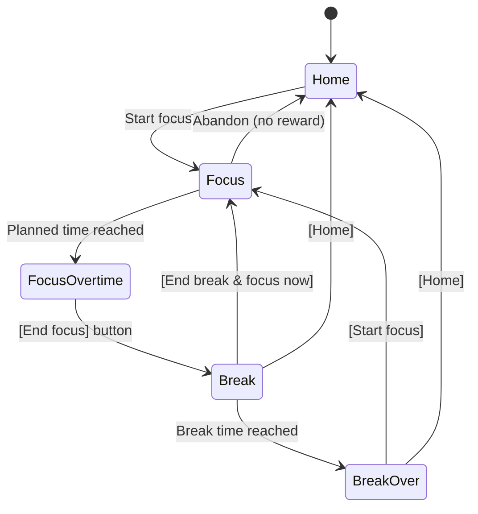

# ARCHITECTURE.md

> This document is the design reference for the coding agent (Claude Code).
> Items marked `[ASSUMPTION]` are defaults that have not been confirmed yet. Update them once the questions in `13. Open Questions` are resolved.

### Related Documents

| File | Purpose |
|---|---|
| `ARCHITECTURE.md` | Structure, data model, timer engine, milestones (this file) |
| `DESIGN.md` | Design system: Part I UI design, Part II 3D rendering |
| `DECISIONS.md` | Project philosophy and architecture decision records (ADRs) |
| `CHANGELOG.md` | History of updates |
| `CLAUDE.md` | Rules for the coding agent, including when to update each document |

---

## 1. Project Overview

| Item | Description |
|---|---|
| Working title | Sift |
| Genre | Pomodoro-style focus timer + collectible rewards |
| Inspiration | Focus Pomo |
| Core loop | Focus → earn a reward (an animal) → animal is placed on the island → island grows → next focus |
| Phase 1 platform | Local web app (desktop browser) |
| Phase 2 platform | iOS / Android apps (App Store / Play Store) |

### 1.1 Top Design Principle: Never Break Immersion

Every design decision follows the principles below. When features conflict, these principles win.

1. **Nothing interrupts a focus session.** No popups, toasts, reward animations, or notification badges while focusing.
2. **The focus screen shows only the timer and a calm, dimmed background.** Controls stay hidden unless needed.
3. **Cycle transitions take one tap.** Focus end → break → next focus are each a single action.
4. **Rewards are revealed during the break.** The reward animation plays only after focus ends.
5. **The timer is never wrong.** Time stays accurate across tab switches, backgrounding, and page reloads.

---

## 2. Language Policy

- **All code, comments, identifiers, commit messages, documentation (`*.md`), and UI text are written in English.**
- UI strings live in a single module (`src/ui/strings.ts`) so localization can be added later without touching components.

---

## 3. Tech Stack

| Area | Choice | Reason |
|---|---|---|
| Language | TypeScript (strict) | Type safety, agent code quality |
| Build | Vite | Fast local development |
| UI | React 18 | Compatible with Capacitor for mobile |
| 3D rendering | three.js + @react-three/fiber + @react-three/drei | Voxel island and animal rendering |
| State | Zustand | Lightweight, fits a timer state machine |
| Persistence | IndexedDB (Dexie.js) | Local storage behind a swappable adapter |
| Styling | CSS Modules or Tailwind `[ASSUMPTION]` | |
| Testing | Vitest (logic), Playwright (E2E smoke test, `npm run e2e`) | |
| Mobile | Capacitor `[ASSUMPTION]` | Maximizes reuse of the web code, including WebGL |

> Mobile strategy: instead of rewriting in React Native, **wrap the same web code with Capacitor**. All platform-dependent features must therefore sit behind adapters in `platform/` (see section 8).

---

## 4. Screens and Flow

### 4.1 Screen List

| Screen | Purpose |
|---|---|
| **Home** | Floating island (3D), start-focus button, entry to settings |
| **Focus** | Fullscreen. Dark background, large centered timer, dimmed island behind it |
| **Break** | Break timer, reward reveal, go home / start focus immediately |
| **Settings** | Focus/break durations, sound, etc. |
| **Collection** `[ASSUMPTION]` | Catalog of collected animals (20 species) |

### 4.2 Flow



### 4.3 Screen Details

**Focus screen**
- Enter fullscreen (Fullscreen API) and keep the screen awake (Screen Wake Lock API).
- Layout:
  - Background: the user's own island, rendered behind a **near-black overlay** (e.g. `rgba(0,0,0,0.8)`), so it is visible but does not draw attention.
  - Center: a **large timer** (remaining time), high contrast, calm typography.
  - Nothing else is visible by default.
- The island shown is the island as it was when focus started. Newly earned animals appear only after the break reveal.
- Transition from Home: the camera slowly pulls back and the overlay fades in (≈1s), so the island stays continuous between screens.
- Rendering while focusing (battery and attention):
  - Fixed camera, no user interaction with the scene.
  - Animal idle animations slowed down or paused `[ASSUMPTION]`.
  - Frame rate capped (e.g. 20–30fps) or on-demand rendering.
- Controls (abandon) are hidden. Moving the mouse / tapping shows them semi-transparently for 3 seconds, then hides them again.
- Abandon requires a **long press (1.5s)** to prevent accidents `[ASSUMPTION]`. **Abandoning gives no reward.**
- When the planned time is reached:
  - The timer switches from countdown to an **overtime count-up (`+05:23`)**.
  - A soft sound plays once `[ASSUMPTION]` (can be disabled in settings).
  - An **[End focus]** button becomes permanently visible.

**Break screen**
- On entry, reveal the animal earned in this session (3–5s, skippable).
- If the session was shorter than the minimum reward time, show a short, neutral message instead (no reward, no guilt-tripping).
- Break countdown.
- Buttons: **[Home]**, **[End break & focus now]**.
- When the break time is reached: play a sound once and wait in a "Ready to focus?" state (no auto-start) `[ASSUMPTION]`.

**Home screen**
- Floating island in the center, animals play idle animations on top.
- Limited camera rotation/zoom `[ASSUMPTION]`.
- Bottom: current cycle (e.g. `25 min focus · 5 min break`) and a **[Start focus]** button.

---

## 5. Reward System

### 5.1 Eligibility and Effective Focus Time

- **Effective focus time = planned time + overtime**, capped at **60 minutes**. Anything over 60 minutes counts exactly as 60 minutes.
- **Minimum for a reward: 25 minutes** of effective focus time. Below that, no reward.
- Abandoned sessions never give a reward.

### 5.2 Tiers

From lowest to highest:

| Tier | Description |
|---|---|
| Common | Everyday small land animals |
| Epic | Larger or less common everyday animals |
| Legendary | Impressive real-world animals |
| Mythic | Fantasy animal (only one species) |

### 5.3 Tier Probabilities

- Tier is **rolled randomly**, not fixed by time.
- Longer focus increases the odds of higher tiers **only slightly**; the distribution should feel similar across durations.
- Probabilities are linearly interpolated between two anchor distributions:

| Tier | At 25 min | At 60 min (max) |
|---|---|---|
| Common | 60% | 50% |
| Epic | 28% | 32% |
| Legendary | 10% | 14% |
| Mythic | 2% | 4% |

```ts
// t = 0 at 25 min, t = 1 at 60 min
const t = clamp((effectiveMinutes - 25) / (60 - 25), 0, 1);
const p = lerp(P_AT_25, P_AT_60, t); // per tier, sums to 1
```

- Anchor values are `[ASSUMPTION]` and must be defined in one place only: `src/domain/config.ts`.
- After the tier roll, the species is chosen uniformly at random within that tier.
- Tier selection and species selection are pure functions with an injectable RNG (for testing).

### 5.4 Animal Catalog (20 species, draft)

| Tier | Animals | Count |
|---|---|---|
| Common | Chick, Rabbit, Duck, Hamster, Squirrel, Hedgehog, Mouse, Frog, **Fish** | 9 |
| Epic | Sheep, Pig, Cat, Dog, Goat, Raccoon | 6 |
| Legendary | Horse, Cow, Deer, Fox | 4 |
| Mythic | **Unicorn** | 1 |

- **Fish:** a flopping fish that hops in place on the grass (a fun, comedic animation). Tier placement is `[ASSUMPTION]`.
- **Unicorn:** the only fantasy animal, the sole Mythic species. Should have a distinctive effect (e.g. subtle sparkle particles, rainbow mane).
- All other animals are everyday land animals.
- The catalog is static data: `src/domain/animals/catalog.ts`
- Each entry: `id`, `name`, `tier`, `modelId`, `idleAnimation`, `footprint` (tiles occupied).

### 5.5 Duplicates `[ASSUMPTION]`
- Duplicate animals are allowed; each one is placed on the island.

---

## 6. 3D World: Floating Voxel Island

### 6.1 View

- **Orthographic camera** at an isometric (quarter-view) angle.
  - Azimuth 45°, elevation ≈ 35.26°.
- The island sits in the center. Below it, dirt/stone layers taper downward like an inverted pyramid so it looks like it floats in the air.
- Background: sky gradient with slowly drifting clouds on Home `[ASSUMPTION]`. On the Focus screen the dark overlay covers the sky.
- The whole island bobs slowly up and down.

### 6.2 Island Structure

```
[ Top ]      Grass blocks (tiles where animals can be placed)
[ Layer 1 ]  Dirt blocks
[ Layer 2..N ] Stone/dirt, narrowing downward (random gaps for a natural look)
```

- 1 unit = 1 block.
- Rendering: one `InstancedMesh` per block type (minimal draw calls).
- Textures: pixel-art style, low-resolution, `NearestFilter`.

### 6.3 Island Growth

- The top surface grows with the number of animals.
- Default rule `[ASSUMPTION]`:
  - Initial size: 7×7
  - Required tiles = `animalCount × 3` (includes free space per animal)
  - Top side length = `max(7, ceil(sqrt(requiredTiles)))`, rounded up to an odd number
- The shape is near-circular: tiles within a Euclidean radius of `side / 2` plus a small seeded jitter (deterministic generation).
- Terrain height is level 1–3 per tile; one level is 0.5 block (`config.island.levelHeight`).
- **Same animal count + same seed = always the same island** (shape never changes on reload).
- A growth animation plays once when returning to Home after the island expands.

### 6.3.1 Stream

- `domain/island/stream.ts`: pure, seed-only stream path (tile centerline + water level per tile), picked from many candidate chords by a score (`StreamContext` supplies the natural terrain and the camp tiles). `generateIsland` replaces the natural terrain on those tiles (bed cut, same level), marks them `water`, and returns the visible run (`streams`, the last tile falls outward over the rim). The outline stays independent of the stream, so islands remain monotone.
- `world/stream/streamMesh.ts` (pure): smoothed ribbon with curved falls and a round head, spray emitters (`spring`, `landing`, `rim`), and the bank mesh that fills each bed tile around the ribbon (marching squares on the distance to the ribbon edge, plus a wall down to the bed).
- `world/stream/Stream.tsx`: renders the ribbon and strips, animates flow streaks and white splash particles (one instanced mesh, stateless per-particle motion).
- Water tiles are excluded from animal placement.

### 6.4 Animal Placement

- New animals go on a random empty grass tile, preferring tiles near the center.
- Placement coordinates are stored in the DB (existing animals keep their position as the island grows).
- Coordinates are relative to the island center (0,0), so they remain valid after expansion.
- Idle behavior: turning in place, short hops, moving one tile, etc. `[ASSUMPTION]`.
- Interaction: clicking an animal (not on Focus, ADR-022) shows a `!` bubble and forces one idle action. Render-only state in `world/animals/Animals.tsx`; nothing is stored.

### 6.5 Voxel Asset Generation

- No external model files. Assets are **voxel data defined in code**.
- Format: `src/assets/voxels/<animalId>.ts`
  ```ts
  export const chick: VoxelModel = {
    size: [4, 5, 4],
    palette: { 1: '#FFD93D', 2: '#FF8C42', 3: '#222222' },
    voxels: [ /* [x, y, z, paletteIndex] */ ],
  };
  ```
- At runtime, `VoxelModel` → merged `BufferGeometry` (hidden faces culled).
- Size guideline: Common 3–5 voxels tall → Mythic 10–12 voxels tall (higher tiers are larger and more detailed).
- Blocks are defined the same way.

---

## 7. Timer Engine

### 7.1 State Machine

```ts
type Phase =
  | { kind: 'idle' }
  | { kind: 'focus'; startedAt: number; plannedMs: number; sessionId: string }
  | { kind: 'focusOvertime'; startedAt: number; plannedMs: number; sessionId: string }
  | { kind: 'break'; startedAt: number; plannedMs: number; rewardId?: string }
  | { kind: 'breakOver'; rewardId?: string };
```

- `focus → focusOvertime` and `break → breakOver` are derived from the current time (`resolvePhase(phase, now)`), so they cannot be missed. Only `idle`, `focus`, and `break` are persisted (ADR-003).

### 7.2 Accuracy Rules

- **Never accumulate time.** Do not add 1 second per `setInterval` tick.
- Always compute elapsed time as `now() - startedAt`.
- Screen updates use `requestAnimationFrame` or a 250ms tick (display only, never the source of truth).
- The active session (`startedAt`, `phase`) is persisted on every change, and restored on reload/relaunch.
- Recompute immediately on `visibilitychange`.

### 7.3 On Focus End

1. Compute effective focus time: `min(endedAt - startedAt, 60 min)`
2. If ≥ 25 min: roll tier → pick species → pick placement tile
3. Save the session, the animal, and the next (break) active phase in a **single transaction**
4. Switch to the break phase

---

## 8. Platform Abstraction Layer

Browser APIs are never called directly; they go through interfaces so the app can move to mobile.

| Interface | Web implementation | Mobile implementation (later) |
|---|---|---|
| `StorageAdapter` | IndexedDB (Dexie) | Capacitor SQLite / Preferences |
| `WakeLockAdapter` | Screen Wake Lock API | Capacitor keep-awake plugin |
| `FullscreenAdapter` | Fullscreen API | Immersive mode / hidden status bar |
| `NotifyAdapter` | Web Audio + (optional) Notification API | Scheduled local notifications |
| `HapticsAdapter` | no-op | Capacitor Haptics |

- Location: `src/platform/<name>/index.ts` (interface) + `web.ts` / `native.ts` (implementations).
- On mobile, JS may be suspended in the background, so **schedule a local notification for the focus end time in advance**.

---

## 9. Data Model

```ts
type Tier = 'common' | 'epic' | 'legendary' | 'mythic';

interface Settings {
  focusMinutes: number;      // default 25, range 5–60 [ASSUMPTION]
  breakMinutes: number;      // default 5, range 1–30 [ASSUMPTION]
  soundEnabled: boolean;
}

interface FocusSession {
  id: string;
  startedAt: number;         // epoch ms
  plannedFocusMs: number;
  endedAt?: number;
  effectiveFocusMs?: number; // planned + overtime, capped at 60 min
  status: 'running' | 'completed' | 'abandoned';
  rewardAnimalId?: string;   // PlacedAnimal.id
}

interface PlacedAnimal {
  id: string;
  speciesId: string;         // catalog id
  tier: Tier;
  tileX: number;             // relative to island center
  tileZ: number;
  acquiredAt: number;
  sessionId: string;
}

interface WorldState {
  seed: number;              // island shape seed (generated once)
}

interface ActivePhase {      // single record for restoring an in-progress session
  phase: Phase;
}
```

- Keep a schema version and manage migrations with Dexie.
- Prepared for future cloud sync: all ids are UUIDs, all timestamps are epoch ms (UTC).

---

## 10. Directory Structure

```
config/
└── app.yaml              # Runtime settings (test mode, map reset on start), bundled at build time
src/
├── app/                  # Routing, global layout, providers, runtimeConfig.ts (reads config/app.yaml)
├── screens/
│   ├── home/
│   ├── focus/
│   ├── break/
│   ├── settings/
│   └── collection/
├── domain/               # Pure logic (no UI or browser dependencies)
│   ├── config.ts         # All tunable numbers (tiers, probabilities, growth)
│   ├── types.ts          # Settings (incl. theme), FocusSession, PlacedAnimal, WorldState
│   ├── random.ts         # Injectable RNG, seeded PRNG, hash, clamp/lerp
│   ├── timer/            # Phase state machine, derived overtime, formatting
│   ├── reward/           # Eligibility, tier roll, species pick
│   ├── animals/          # Catalog
│   ├── island/           # Island size, shape generation, placement
│   └── stats/            # Collection stats
├── world/                # three.js / R3F rendering
│   ├── voxel/            # VoxelModel → mesh data (pure) → BufferGeometry
│   ├── island/           # Island meshes, growth animation
│   ├── animals/          # Animal meshes, idle animations, unicorn sparkles
│   ├── camera/           # Isometric camera rig, Home ↔ Focus transition
│   ├── props/            # Camp: hut and campfire (night lighting)
│   ├── stream/           # Stream ribbon, waterfalls, splash
│   ├── preview/          # Small canvas for the Break reward card
│   ├── Scene.tsx         # The one persistent canvas (+ Clouds, RenderDriver, palette)
├── assets/
│   └── voxels/           # Animal voxel definitions (TS) + builder helper (sounds are synthesized, ADR-006)
├── store/                # Zustand app store (injectable deps) and React hook
├── platform/             # Platform adapters (section 8); index.ts wires the web implementations
├── db/                   # Dexie schema, repositories
├── ui/                   # tokens.css/ts, strings.ts, hooks, shared components
└── main.tsx
e2e/                      # Playwright smoke test (npm run e2e)
```

**Dependency rules**
- `domain/` imports nothing outside itself (pure TS).
- `world/` and `screens/` may use `domain/` and `store/`. `ui/ThemeToggle` also reads the store.
- Browser APIs are called only from `platform/`.

---

## 11. Milestones

| Milestone | Scope | Done when |
|---|---|---|
| M1 | Timer core | Focus/overtime/break cycle works, survives reload, settings persist |
| M2 | Reward logic | 25-min minimum, 60-min cap, interpolated tier roll, persistence (with unit tests) |
| M3 | Voxel renderer + island | Isometric view, floating island, growth by animal count |
| M4 | Focus screen immersion | Dark overlay over island, large timer, fullscreen, wake lock, auto-hiding controls, sound |
| M5 | 20 animal assets | Voxel models, idle animations (flopping fish, unicorn effect), reward reveal |
| M6 | Collection & polish | Collection screen, simple stats `[ASSUMPTION]`, responsive layout |
| M7 | Mobile | Capacitor wrapper, native adapters, local notifications |

---

## 12. Rules for the Coding Agent

- Write everything in English (see section 2).
- Follow `CLAUDE.md` for document maintenance: log changes in `CHANGELOG.md`, record decisions as ADRs in `DECISIONS.md`, and follow `DESIGN.md` for all visual work.
- Every module in `domain/` must have Vitest unit tests, especially time calculations, the 25-min threshold, the 60-min cap, probability interpolation (distributions sum to 1), and island size.
- Time-dependent logic takes an injected `now()` for testability.
- All tunable numbers (reward threshold, cap, tier probabilities, growth factor, default durations) live in `src/domain/config.ts`.
- Before adding any UI element to the Focus screen, check it against the immersion principles in 1.1.
- Colors, fonts, motion durations, and voxel art rules come from `DESIGN.md`; never invent new ones inline.
- Keep one persistent 3D canvas across Home and Focus (do not remount), and switch its render mode (full on Home, dimmed/throttled on Focus).
- Performance targets: Home at 60fps with 100 animals; Focus screen at low GPU usage.

---

## 13. Open Questions

| # | Question | Current assumption |
|---|---|---|
| Q1 | Which tier should the fish belong to? | Common |
| Q2 | Are the tier probability anchors (60/28/10/2 → 50/32/14/4) acceptable? | Yes |
| Q3 | Should animals move slightly on the Focus screen, or be completely still? | Slowed down |
| Q4 | Should the next focus start automatically when the break ends? | No, wait for the user |
| Q5 | Ambient sounds during focus (rain, etc.)? | Only an end-of-focus chime |
| Q6 | Long breaks (e.g. 15 min every 4 cycles)? | Not supported |
| Q7 | Can the user move or arrange animals on the island? | Automatic placement only |
| Q8 | Rewards other than animals (trees, flowers, decorations)? | Animals only |
| Q9 | Stats screen (daily/weekly focus time)? | Simple version in M6 |
| Q10 | Accounts / cloud sync in the future? | Local only, schema prepared |
| Q11 | Mobile approach | Capacitor wrapper |
