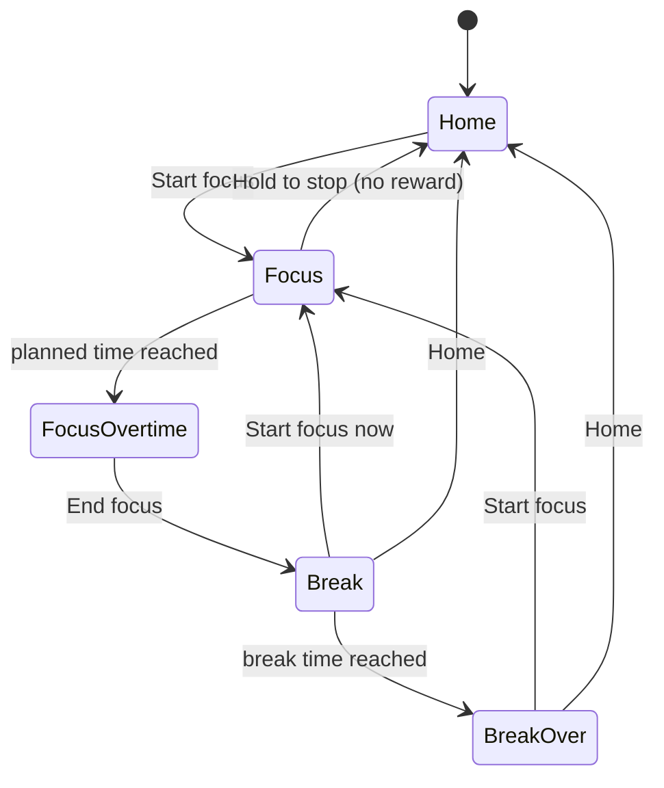

# ARCHITECTURE.md

> The coding agent's reference for structure, rules and settled decisions. `docs/DESIGN.md` covers look and feel.
> `(ADR-0xx)` tags point to the human-facing log `docs/DECISIONS.md`; the rule stated here is what counts.
> `[ASSUMPTION]` = default applied, not yet confirmed by the owner (see §12).

## 1. Product

- **Sift**: Pomodoro-style focus timer with collectible rewards (inspiration: Focus Pomo).
- **Loop**: focus → earn a random animal → it is placed on a floating voxel island → the island grows → focus again.
- **Platforms**: Phase 1 local desktop web app (done). Phase 2 iOS/Android by wrapping the same code with Capacitor (deferred, ADR-002).
- **Work model**: features come from `docs/guidance_vN.md`, implemented step by step. Everything so far is guidance_v1.

**Philosophy**: focus is the product, rewards are the garnish. Honest time: rewards only for real, completed focus. Gentle motivation: longer focus helps only slightly, and nothing worse than "no reward" ever happens. The island records accumulated effort.

**Immersion principles** (win every conflict):
1. Nothing interrupts focus: no popups, toasts, badges, or reward animations.
2. Focus shows only the timer over a dimmed island; controls stay hidden until needed.
3. Each cycle transition is one tap.
4. Rewards are revealed only on Break.
5. The timer is never wrong (tab switches, backgrounding, reloads).

## 2. Stack and conventions

| Area | Choice |
|---|---|
| Language / build | TypeScript (strict), Vite |
| UI | React 18, CSS Modules + CSS custom properties from `tokens.css` (ADR-001) |
| 3D | three.js + @react-three/fiber. No drei: custom `CameraRig` (ADR-009) |
| State | Zustand (store with injectable deps) |
| Storage | IndexedDB via Dexie, behind `StorageAdapter` |
| Sound | Synthesized with Web Audio, no audio files (ADR-006) |
| Tests | Vitest (logic), Playwright smoke test `npm run e2e` |
| Mobile (later) | Capacitor |

- All code, comments, docs, commits and UI text in English. UI strings only in `src/ui/strings.ts`.
- All tunable numbers live in `src/domain/config.ts`. Visual values come from `DESIGN.md`; never inline new ones.

## 3. Screens and flow



| Screen | Rules |
|---|---|
| Home | Island with idle animals; limited rotate/zoom; current cycle + Start focus; top bar (theme, collection, settings) |
| Focus | Fullscreen + wake lock. Near-black overlay over the island as it was at focus start. Large timer only. Hidden "Hold to stop" (1.5 s long press) shows for 3 s on pointer move. At planned time: count-up `+05:23`, one chime, permanent End focus button |
| Break | Reward reveal (card fades in, model spins, tier chime; after 3.5 s or tap the animal joins the island; buttons usable throughout, ADR-011) or a neutral no-reward message. Break countdown, then "Ready for the next one?" with chime. Never auto-starts focus |
| Settings | Focus 5–60 min (step 5), break 1–30 min, chimes toggle; saves instantly |
| Collection | All 50 species (silhouettes if not owned, counts if duplicated) + stats: total focus time, completed sessions, species `n / 50` |

## 4. Timer engine

```ts
type Phase =
  | { kind: 'idle' }
  | { kind: 'focus'; startedAt: number; plannedMs: number; sessionId: string }
  | { kind: 'focusOvertime'; startedAt: number; plannedMs: number; sessionId: string }
  | { kind: 'break'; startedAt: number; plannedMs: number; rewardId?: string }
  | { kind: 'breakOver'; rewardId?: string };
```

- Persist only `idle`, `focus`, `break`. `resolvePhase(phase, now)` derives `focusOvertime` / `breakOver`, so they cannot be missed (ADR-003).
- Elapsed = `now() - startedAt`, never accumulated ticks. Display ticks (250 ms) are not a source of truth. Recompute on `visibilitychange`. Phase is persisted on every change and restored on reload.
- **Focus end**, in one DB transaction (no double rewards): effective time `min(endedAt - startedAt, 60 min)` → if ≥ 25 min roll tier, species, tile → save session + animal + next `break` phase.
- Time-dependent logic takes an injected `now()`.

## 5. Rewards

- **Effective focus** = planned + overtime, capped at 60 min. **Minimum 25 min**. Abandon = no reward.
- Focus can be set below 25 min; such sessions earn only with overtime, and the no-reward message explains it (ADR-012) `[ASSUMPTION]`.
- **Tiers**, lowest to highest: Common < Mythic < Epic < Legendary (`TIERS` in `config.ts`; ADR-026/027).
- Tier is rolled; odds interpolate linearly from 25 to 60 min (`[ASSUMPTION]`); species is then uniform within the tier. Pure functions with an injectable RNG.

| Tier | 25 min | 60 min | Species |
|---|---|---|---|
| Common | 60% | 50% | 25: Chick, Rabbit, Duck, Hamster, Squirrel, Hedgehog, Mouse, Frog, Fish, Snail, Ladybug, Bee, Butterfly, Beetle, Turtle, Crab, Starfish, Mole, Sparrow, Pigeon, Hen, Guinea Pig, Lizard, Bat, Ferret |
| Mythic | 28% | 32% | 14: Sheep, Pig, Cat, Dog, Goat, Raccoon, Penguin, Owl, Otter, Beaver, Capybara, Axolotl, Parrot, Koala |
| Epic | 10% | 14% | 9: Horse, Cow, Deer, Fox, Wolf, Bear, Panda, Red Panda, Peacock |
| Legendary | 2% | 4% | 2: Unicorn (rainbow mane, rainbow bursts), Tiger (forehead 王). Both sparkle |

- Catalog is static data (`domain/animals/catalog.ts`): `id`, `name`, `tier`, `modelId`, `idleAnimation`, `footprint`. Duplicates allowed; each is placed.
- Probabilities, chimes, model size limits and colors follow the **rank**, not the name. Renames migrate stored animals via a new Dexie version.

## 6. 3D world

**Scene and camera**
- One persistent `<Canvas>` for Home, Focus and Break; never remounted. Break reward card uses its own small canvas only while visible; Collection uses 2D pixel sprites (ADR-007).
- Orthographic isometric camera (azimuth 45°, elevation ≈ 35.26°). Fits the island top + 35% of the underside with a 5% margin, re-fits on growth, avoids the screen area under panels (ADR-014).
- Render modes: Home full (60 fps, interaction). Focus dimmed: fixed camera, 24 fps cap, animals at 0.25 speed, no clouds, 1 s camera pull-back. Break full, fixed camera.

**Island**
- Deterministic: same seed + same animal count = same island. Shapes are **monotone** (growth only adds tiles), so stored animal coordinates (relative to center) stay valid.
- Size: side = `max(7, ceil(sqrt(animals × 3)))`, odd. Near-circular outline (Euclidean + seeded jitter) (ADR-017).
- Terrain levels 1–3, each 0.5 block. Domain-warped noise + weak back-high tilt, terraced (mostly plains, some hills/lowlands), flat around the camp (ADR-018).
- Underside: inverted pyramid with random gaps. Blocks are flat-colored cubes, one `InstancedMesh` per type, ±4% tint (ADR-008).
- During Break with a reward, the island is sized from `animals - 1`; the growth (700 ms scale-in) shows when returning Home (ADR-013).

**Camp and night mode** (ADR-016, ADR-017)
- `Settings.theme` `light | dark`, toggled from the top bar, locked during Focus.
- Campfire on (0,0), log cabin on (-2,0) with its door facing the fire. Both tiles are reserved (never used for placement) and flat.
- Focus routines picked by theme at focus start: day = animals walk into the cabin; night = they sleep near it. They return on Break. Reload into Focus shows the end state; reduced motion snaps.

**Stream** (ADR-020, ADR-021)
- One winding stream per island, from the seed only: best-scoring wobbling chord, avoids the camp, starts at a spring, falls off the rim outward. Cached per seed (~500 path traces).
- Stream tiles keep their natural level with a 0.25 bed cut; water never flows uphill; only the first unbroken run is water. Water tiles are excluded from placement.
- Modules: `domain/island/stream.ts` (path), `world/stream/streamMesh.ts` (ribbon, falls, bank mesh), `world/stream/Stream.tsx` (render, flow, stateless splash particles).

**Animals**
- One 1×1 tile per animal; placed on a random free grass tile near the center; idle stays in the tile: turn, hop, shuffle (ADR-005).
- Exception: the butterfly flaps (separate wing meshes) and flies up to 1.2 tiles from its tile (ADR-024).
- World scale 0.25× (animal voxel = 1/6 block in the model, 1/24 on the island) (ADR-014).
- Model limits: width ≤ 6 voxels; depth ≤ 6, or 8 for Epic and Legendary (ADR-025).
- Poke: clicking an animal (not on Focus) shows a `!` bubble and forces one idle action. Render-only state (ADR-022).
- Voxel models are TS data in `src/assets/voxels/<id>.ts`, merged into one cached `BufferGeometry` per species (hidden faces culled).

## 7. Platform layer

Capability APIs only through `src/platform/<name>/` (interface `index.ts`, web `web.ts`, later `native.ts`):

| Adapter | Web | Native (later) |
|---|---|---|
| `StorageAdapter` | IndexedDB (Dexie) | Capacitor SQLite / Preferences |
| `WakeLockAdapter` | Screen Wake Lock API | keep-awake plugin |
| `FullscreenAdapter` | Fullscreen API | immersive mode |
| `NotifyAdapter` | Web Audio chimes | scheduled local notification for focus end (JS may be suspended) |
| `HapticsAdapter` | no-op | Capacitor Haptics |

- "Capability API" = storage, wake lock, fullscreen, audio/notifications, haptics. DOM events, `visibilitychange`, `matchMedia`, `Date.now` are fine in `ui/`, `screens/`, `world/` (ADR-010).
- Write no untested native stubs before M7 (ADR-002).

## 8. Data model

```ts
type Tier = 'common' | 'mythic' | 'epic' | 'legendary';
interface Settings { focusMinutes: number; breakMinutes: number; soundEnabled: boolean; theme: 'light' | 'dark' }
interface FocusSession {
  id: string; startedAt: number; plannedFocusMs: number; endedAt?: number;
  effectiveFocusMs?: number; status: 'running' | 'completed' | 'abandoned'; rewardAnimalId?: string;
}
interface PlacedAnimal { id: string; speciesId: string; tier: Tier; tileX: number; tileZ: number; acquiredAt: number; sessionId: string }
interface WorldState { seed: number }   // generated once
interface ActivePhase { phase: Phase }  // restores an in-progress session
```

- Dexie tables: `kv` (settings, world, phase), `sessions`, `animals`. Schema **v3** (v2, v3 rename stored tiers).
- Every change adds a new `db.version(n)` with an `upgrade`; never edit old versions.
- UUID ids and UTC epoch-ms times, ready for future sync. The island itself is never stored (derived from seed + count).

## 9. Runtime config

`config/app.yaml`, bundled at build time (ADR-015, ADR-019):
- `testMode` (`enabled`, `speciesCount`, `allSpecies`): fills the island in memory at startup; never stored, rewards untouched.
- `resetMapOnStart`: new seed and all placed animals deleted on every start.
- **Both are ON for development. Set both to `false` before release.**

## 10. Directory structure

```
docs/            ARCHITECTURE, DESIGN, DECISIONS (human log), CHANGELOG, PROJECT_STATUS, guidance_vN
config/app.yaml  runtime config
e2e/             Playwright smoke test
src/
├── app/         App, routing, runtimeConfig.ts
├── screens/     home, focus, break, settings, collection
├── domain/      pure logic: config, types, random, timer/, reward/, animals/, island/ (+stream), stats/
├── world/       Scene, Clouds, RenderDriver, palette, voxel/, island/, animals/, camera/, props/ (camp), stream/, preview/
├── assets/voxels/  animal models + builder
├── store/       Zustand store
├── platform/    adapters (§7)
├── db/          Dexie schema, repositories
└── ui/          tokens.css/ts, strings.ts, hooks, components/
```

- `domain/` imports nothing outside itself. `world/` and `screens/` may use `domain/` and `store/`. Capability APIs only in `platform/`.

## 11. Milestones

| | Scope | Status |
|---|---|---|
| M1 | Timer core: cycle, reload-safe, settings | Done |
| M2 | Rewards: 25 min min, 60 min cap, tier roll, atomic commit | Done |
| M3 | Voxel island, growth, camera | Done |
| M4 | Focus immersion: overlay, timer, fullscreen, wake lock, hidden controls, sound | Done |
| M5 | Animals (now 50), idle animations, reward reveal | Done |
| M6 | Collection, stats, responsive layout | Done |
| M7 | Mobile: Capacitor, native adapters, local notifications | Not started |

**Rules for the agent**
- Every `domain/` module has Vitest tests (time math, 25 min threshold, 60 min cap, probabilities sum to 1, island size and monotonicity).
- Check every Focus-screen addition against §1.
- Performance: Home 60 fps with 100 animals (not yet measured); Focus low GPU. No per-frame allocations; dispose on unmount.

## 12. Open questions (current defaults, ADR-004)

| # | Question | Default |
|---|---|---|
| Q1 | Fish tier | Common |
| Q2 | Tier odds 60/28/10/2 → 50/32/14/4 | Accepted |
| Q3 | Animals on Focus | Slowed + day/night routines |
| Q4 | Auto-start focus after break | No |
| Q5 | Ambient sound while focusing | No, end chime only |
| Q6 | Long breaks | Not supported |
| Q7 | Arrange animals | No; poke only |
| Q8 | Non-animal rewards | No |
| Q9 | Stats | All-time totals only |
| Q10 | Accounts / sync | Local only, schema ready |
| Q11 | Mobile approach | Capacitor |

**Known limits**: no pathfinding (routine walks may cross the cabin or stream); animals saved before the camp/stream may overlap them; the butterfly may fly over water and the camp.
